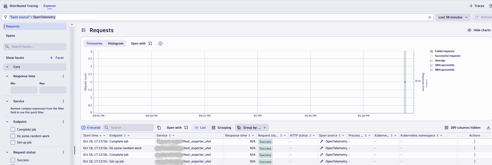
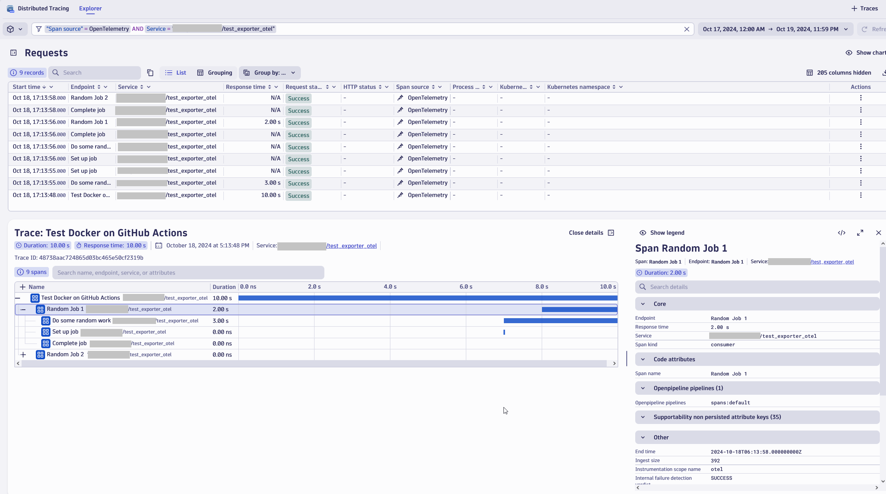
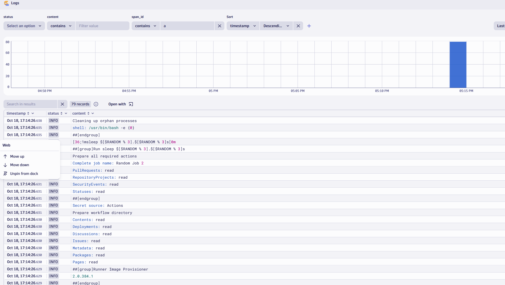

# OTLP GitHubAction Exporter
<p float="left">
  
</p>
A GitHub Action to export Workflow runs as OTel Traces, Metric and Logs via OTLP


## Monitoring Github Actions with OTLP
This action will allow you to monitor your Github Actions with OpenTelemetry.
This Action works as an exporter, that will create OpenTelemetry Traces and Spans for the steps within your GitHub Workflows.

These details and metrics can then be used to analyse the performance of your CI/CD workflows.


## How to guides

### Configuring the OTel GitHubAction Exporter for Dynatrace.

Before setting up the integration, you will need a [Dynatrace API Token](https://docs.dynatrace.com/docs/dynatrace-api/basics/dynatrace-api-authentication).
This will require the following permissions:
- openTelemetryTrace.ingest
- logs.ingest
- metrics.ingest

Also, refer to the Dynatrace Open Telemetry information page:
[Using OpenTelemetry with Dynatrace](https://docs.dynatrace.com/docs/get-started/opentelemetry)


1. Configure your Dynatrace API Token as a secret in your repository, and call it `DYNATRACE_OTEL_API_TOKEN`
2. Configure your Dynatrace OTLP Endpoint as the `OTEL_EXPORTER_OTLP_ENDPOINT` - eg. "https://abc12345.live.dynatrace.com/api/v2/otlp/"
3. Configure your Dynatrace `OTLP_PROTOCOL` as "HTTP" (Optional as HTTP is the default value)
4. Configure your `OTEL_EXPORTER_OTLP_HEADERS` as `Authorization=Api-Token ${{ secrets.DYNATRACE_OTEL_API_TOKEN }}` to allow it to use the secret from step 1
5. The exporter uses automatic token authentication by default, for this you need to ensure that `GITHUB_TOKEN` has at least read access to the action scope (see example [Here](OTLP-GitHubAction-Exporter.yaml.dynatrace.example?plain=1#L8)).

### General Tips
Create your workflow yaml, under .github/workflows, this can be named anything you like.
Refer to the [Example Workflow YML](OTLP-GitHubAction-Exporter.yaml.dynatrace.example).

By having the trigger as:
```
on:
  workflow_run:
    workflows: ['*']
    types: [completed]
```
This means it will run whenever any of your other workflows complete - which means you don't need to edit any existing workflows, just put the new yaml file alongside the others in your repository.

## Required Configuration Options
**ACTION_TOKEN** - Typically ${{ secrets.GITHUB_TOKEN }} - however a PAT can be used if it has appropriate permissions

**OTEL_EXPORTER_OTLP_ENDPOINT** - This is the base endpoint URL for the OTLP Exporters. See [OpenTelemetry Docs](https://opentelemetry.io/docs/languages/sdk-configuration/otlp-exporter/#otel_exporter_otlp_endpoint)

**WORKFLOW_RUN_ID** - This contains the Workflow Run ID for the workflow that triggered this Workflow (ensure it is using the github.event context)

**WORKFLOW_RUN_NAME** - This contains the Workflow Run Name for the workflow that triggered this Workflow (ensure it is using the github.event context)

## Optional Configuration
**OTLP_PROTOCOL** - This determines the protocol to use for the Exporters (HTTP or GRPC) - Defaults to HTTP

**OTEL_EXPORTER_OTLP_HEADERS** - Technically optional, however a lot of receivers will need this for the Authorization. This can be used to set the Headers for the OTLP Exporter (Authorization: Api-Token dtc.01......). Enter these in a commas separated, key=value format. See [OpenTelemetry Docs](https://opentelemetry.io/docs/languages/sdk-configuration/otlp-exporter/#otel_exporter_otlp_headers)

**GITHUB_DEBUG** - see [Troubleshooting](#Troubleshooting)

## Examples

Traces are viewable in the Distributed Tracing app within Dynatrace. The service name will be your repository name:


Each trace can be opened to show the steps in context:


Logs will be available through the Traces view, or the Logs application:


## Troubleshooting 

- Configure `GITHUB_DEBUG` as true in your workflow file

## Contributing

Please create an issue/PR as needed [OTEL GitHubAction Exporter](/../../issues).
Example configs and screenshots for other systems would be more than welcome!

## License

Dynatrace GitHubAction Exporter is based on [gha-new-relic-exporter](https://github.com/newrelic-experimental/gha-new-relic-exporter/) and has been modified to use Protobuf over HTTP rather than GRPC, and to use the required Authorization header for Dynatrace. This wouldn't be possible (from me at least) without their hard work!

Dynatrace GitHubAction Exporter is licensed under the [Apache 2.0](http://apache.org/licenses/LICENSE-2.0.txt) License.

>Dynatrace GitHubAction Exporter also use source code from third-party libraries. You can find full details on which libraries are used and the terms under which they are licensed in the [third-party notices document](THIRDPARTYLICENSES).